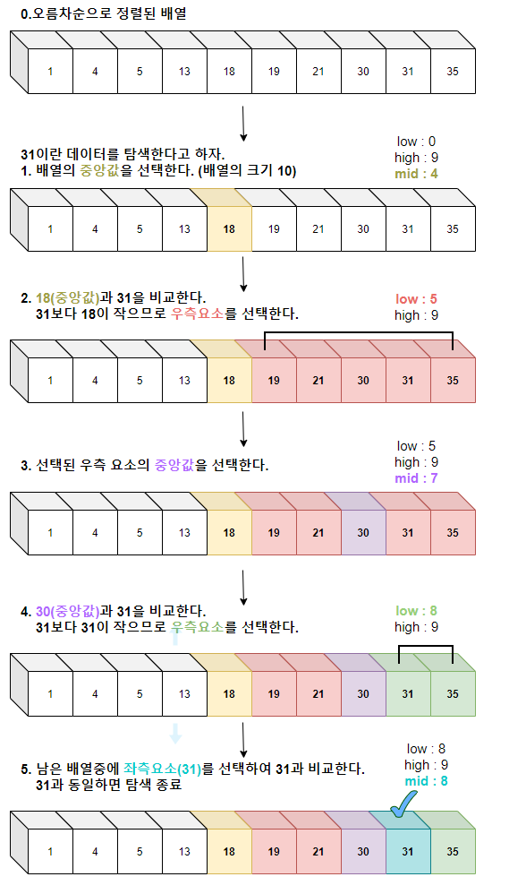

Binary Search
==

- 정렬되어 있는 리스트에서 탐색 범위를 절반씩 좁혀가며 데이터를 탐색하는 방법.
- **정렬되어 있어야만 사용할 수 있다.**
- 변수 3개 (`start`, `end`, `mid`)를 사용하여 탐색한다. 찾으려는 데이터와 중간점 위치에 있는 데이터를 반복적으로 비교하여 원하는 데이터를 찾는다.

과정
--



1. 배열의 중간에 위치한 임의의 값을 선택한다.

2. 선택된 값과 찾고자 하는 값 X와 비교한다.

3. X가 더 작으면 중간값을 기준으로 왼쪽에 있는 데이터들을 대상으로, X가 더 크면 중간값을 기준으로 오른족에 있는 데이터들을 대상으로 1 - 3번을 반복한다.


예시
--

- 정렬된 배열에서 특정 값 이상 또는 초과인 원소가 처음 등장하는 위치 찾기


JAVA
--
```java
class Binary {
  public int search(int[] arr, int start, int end, int x) {
    if (start > end) {	// 시작 인덱스가 마지막 인덱스보다 커지면 x가 배열 내에 없는 것
      return -1;	// -1 return
    }

    int mid = (start + end) / 2;	// 중간값의 인덱스

    if (arr[mid] == x) {	// 중간값이 x라면
      return mid;	// 중간값의 인덱스 return
    } else if(arr[mid] > x) {	// 중간값이 더 크다면
      return search(arr, start, mid-1, x);  // 중간값의 오른쪽에 위치한 데이터들을 대상으로 다시 search
    } else {	// 중간값이 더 작다면
      return search(arr, mid+1, end, x);  // 중간값의 왼쪽에 위치한 데이터들을 대상으로 다시 search
    }
  }
}
```