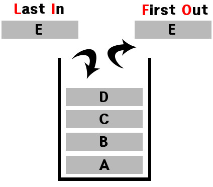
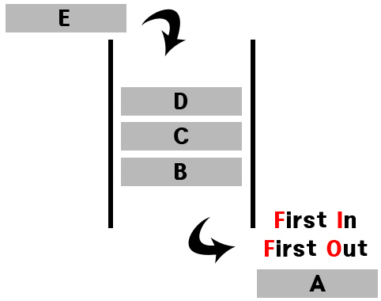
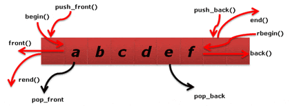

Data Structure
==

Stack
--



- Stack이란 쌓아 올린다는 의미로 책을 쌓는 것처럼 차곡차곡 쌓아 올린 형태의 자료구조를 의미
- Last In, First Out (LIFO) 구조
- 한 쪽 끝에서만 자료를 넣거나 뺄 수 있는 선형구조
- `push` : 데이터를 넣는 연산 / `pop` : 데이터를 꺼내는 행위
- 프로그래밍 언어마다 라이브러리로 구현되어 있지만 직접 사용자가 연결 리스트를 이용하여 구현할 수도 있다.

### 구현 (Java)
```java
import java.util.ArrayList;
import java.util.List;

public class MyStack {
  public List<Object> stack = new ArrayList<Object>();

  public void push(Object obj) {
    stack.add(obj);
  }

  public Object pop() {
    if(stack.size() == 0) return 'stack is empty';
    return stack.remove(stack.size()-1);
  }

  public boolean isEmpty() {
    if(stack.size() == 0) return true;
    return false;
  }

  public Object peek() {
    if(stack.size() == 0) return 'stack is empty';
    return stack.get(stack.size()-1);
  }
}
```


Queue
--



- queue는 줄을 서서 기다린다는 의미로 먼저 들어온 데이터가 먼저 나가는 자료 구조
- First In, First Out(FIFO) 구조
- 한 쪽 끝에서는 삭제 연산만, 다른 한 쪽 끝에서는 삽입 연산만 수행된다.
- 큐의 가장 첫 원소를 `front`, 가장 끝 원소를 `rear`라 한다.
- `add` : 데이터를 넣는 연산 / `remove` : 데이터를 삭제하는 연산

### 구현 (JAVA)

```java
import java.util.ArrayList;
import java.util.List;

class MyQueue {
  private List<Object> que = new ArrayList<Object>();

  public void add(Object item) {
    que.add(item);
  }

  public Object remove() {
    int length = que.size();
    if(length == 0) {
      return null;
    }
    
    return que.remove(0);
  }

  public Object peek() {
    int length = que.size();
    if(length == 0) {
      return null;
    }

    return que.get(length - 1);
  }
  
  public boolean isEmpty() {
    if(que.size() == 0) {
      return true;
    }

    return false;
  }

}
```

Deque
--


- Double-ended Queue의 약자로 양쪽 끝에서 삽입과 삭제가 모두 가능한 자료구조.
- 두 개의 포인터를 사용하여 삽입과 삭제를 발생.
- 큐와 스택을 합친 형태.